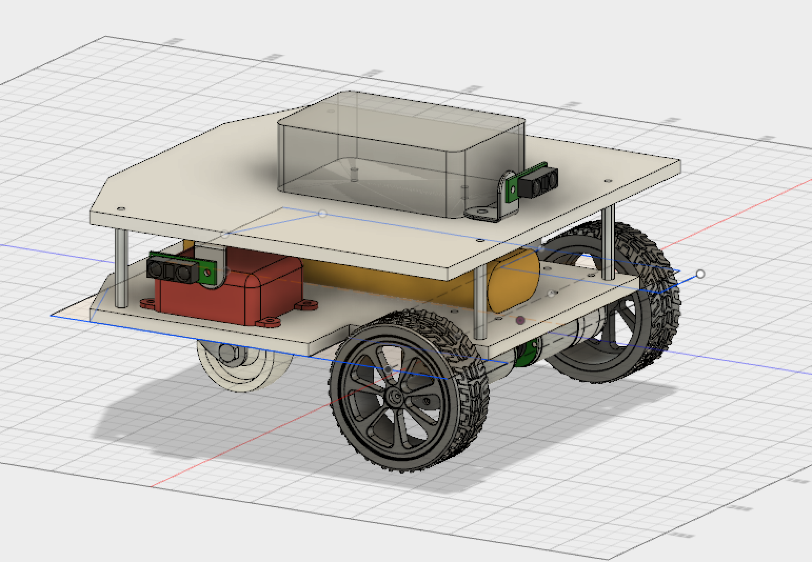

# B2 - Hide & Seek Robot
#### ...and more importantly, an educational platform for me, my kids, and my friends.

### *This project is not yet complete*

This is my ROS project consisting of the custom code for my robot named **B2**.

B2 is a 2-wheel differential drive robot. It's initial design goal is to create a Hide & Seek robot that will roam a single floor in a multi-room house looking for a person hiding. This goal was suggested by my elementary school age kids when I was searching for a goal for which to build a robot from scratch.

### The Initial Design

First, I modeled the robot in Fusion 360:

### Buiding the Drive Base

Then I built the lower level which contained the drive system. I source parts from Pololu, Mouser, Amazon.com, and the local Ace Hardware store.

Pololu had a big sale during Black Friday 2017, so I picked up a bunch of parts during that sale, including a [Roboclaw 2Ax7 motor controller](https://www.pololu.com/product/3284). This is the red box on the lower shelf in the design picture above. 

This was a great move, because my alternative was to use an Adrduino as the controller, but the Roboclaw has far more capability, works great, and with the Pololu sale was about the same price as an Arduino Uno board. I had already researhed and figured out the math to implement a PID_controller, but it saved me a lot of time (i.e. nights & weekends) not having to code and debug one of those.

Some pages that helped me understand PID Controllers:

* [Wikipedia: PID Controller](https://en.wikipedia.org/wiki/PID_controller)
* [Good intro to PID controllers by Andrew Kramer](http://andrewjkramer.net/pid-motor-control/)

### Integrating the Drive Base into ROS

After getting the Roboclaw working with the drive motors, I moved on to finding a ROS node to drive the Roboclaw from a Raspberry PI 3 (the grey box pictured on the top shelf above). After searching through the ROS projects I could find that worked with the Roboclaw, I decided to create my own:

[https://github.com/sheaffej/roboclaw_driver](https://github.com/sheaffej/roboclaw_driver)

Once I could control the Roboclaw as a ROS node, I moved on to creating a basic base_node ROS node, and a joystick teleop_node to manually drive the robot around. 

The teleop_node was very straight forward. 

However the base_node required me to learn a bunch about robot kinematics, some linear algebra, and do a refresh of trigonmetry.

### Leaning Kinematics, Linear Algebra, and Odometry

Below are some pages that helped me understand Kinematics, linear algebra, and Odometry calculations.

This paper by Columbia University helped me understand the theorectical math of Forward and Inverse Kinematics. This introduced me to several terms that I would need to use, but the math here was too far removed from my scenario, so I used different equations.

* [http://www8.cs.umu.se/kurser/5DV122/HT13/material/Hellstrom-ForwardKinematics.pdf](http://www.cs.columbia.edu/~allen/F17/NOTES/icckinematics.pdf)

These videos helped me understand how the equations for control and odometry were derived. I ended up using different equations (see Christoph Rösmann's answer below), but seeing how the equations were derived and work toghether helped me visualize the concepts behind the equations, which allowed me to understand the other variants of equations I found on the web:

* [(YouTube) Georgia Tech: Control of Mobile Robots- 2.2 Differential Drive Robots](https://youtu.be/aE7RQNhwnPQ)
* [(YouTube) Georgia Tech: Control of Mobile Robots- 2.3 Odometry](https://youtu.be/XbXhA4k7Ur8)

I found this page succinct but clear. It filled in a lot of gaps for me, specifically related to why the ROS calculations looked different from the kinematic calculations used in non-ROS applications. TL/DR: ROS calculates angular velocity from the center of the robot, where most kinematics papers calculate it from the ICC. That changes the math a lot!

* [http://robotsforroboticists.com/drive-kinematics/](http://robotsforroboticists.com/drive-kinematics/)

Ultimately, to understand how to calculate odometry, I needed to learn some linear algebra. In both of my undergraduate and masters degrees, I managed to avoid linear algebra, so I had to learn it now. I will say, that having a real-world problem to solve when learning math makes a HUGE difference. Having an odometry problem to solve, and these really great videos, I was able to learn what I needed about linear algebra pretty quickly. I only needed to watch up to video #6 which deals with 3D transformations.

* [YouTube playlist: Essence of linear algebra](https://www.youtube.com/playlist?list=PLZHQObOWTQDPD3MizzM2xVFitgF8hE_ab)

This answer by Christoph Rösmann ultimately was the template I used for my odometry calculations. I came across this page early on during my research, and it made very little sense to me at that time. But then after studying the other topics above, when I finally stumbled on this page again this answer really pulled it all together for me.

* [https://answers.ros.org/question/231942/computing-odometry-from-two-velocities/](https://answers.ros.org/question/231942/computing-odometry-from-two-velocities/)

